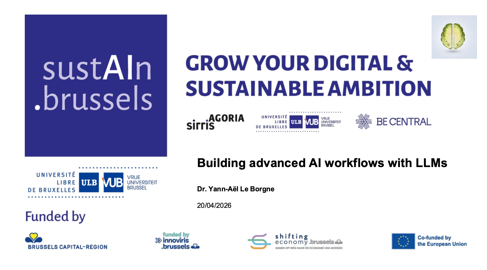

# SustAIn.Brussels training: Advanced AI workflows with LLMs

This repository contains the training material for the [SustAIn.Brussels training track on Advanced AI workflows with LLMs](https://www.sustain.brussels/fr_BE/event/building-advanced-ai-workflows-with-llms-187/register). The track took place between the 20th of April 2026 and the 22nd of April 2026, at [FARI](https://www.fari.brussels/) (12 hours in three half-days).

The slides are available [in PDF format](https://github.com/Yannael/gen-ai-sustain-brussels/tree/main/Part_1_Intro_ChatGPT_AI_Assistants).

The hands-on sessions relied on the following notebooks :

**Getting started with Colab**

- Get started with Colab 

**Next-word prediction, chat templates, thinking mode**

- Next-word prediction with GPT2 
- Chat templates 
- Thinking Mode in Qwen3.5-0.8B 

**API**

- "Hello world OpenAI": Connect to the OpenAI API and get responses from an OpenAI model 
- JSON output with the OpenAI API 
- OpenRouter: Access multiple LLMs through a single API 
- Benchmarking LLMs 

**Agents**

- Build an agent from scratch 
- Smolagents and tools 

**Building apps**

- Gradio tutorial: Build interactive AI apps 
